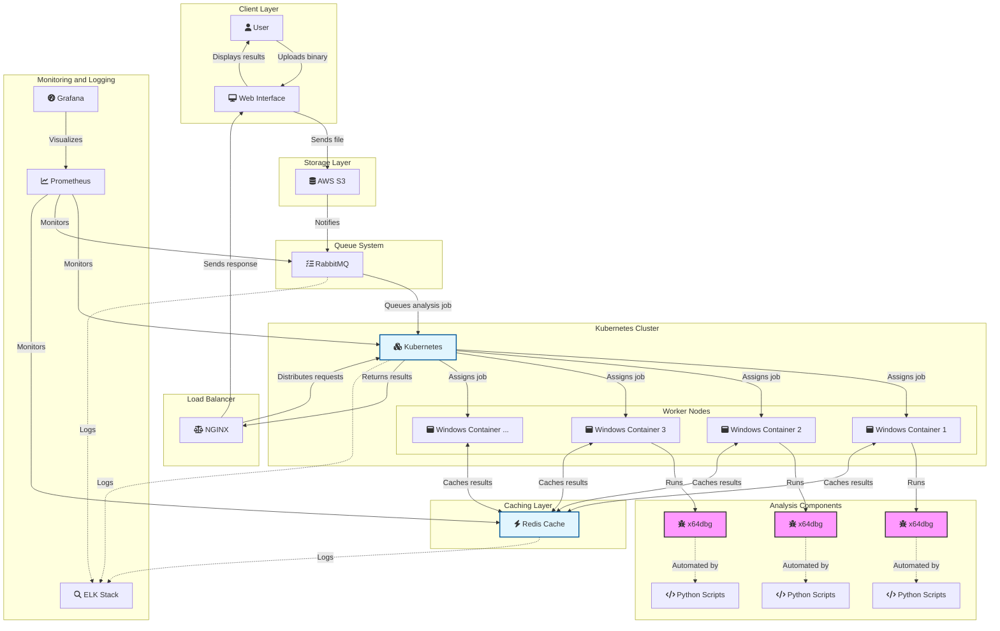

# HexGuard

HexGuard is a dynamic binary analysis tool built with Go and Python, leveraging x64dbg for automated malware detection. It helps security professionals and developers analyze binaries for malicious behavior by monitoring system calls, API interactions, and generating comprehensive reports.

## Architecture




## Features

- **Dynamic Analysis**: Automatically analyzes binaries to detect suspicious behavior patterns.
- **API Integration**: RESTful API for uploading binaries and retrieving analysis results.
- **Report Generation**: Generates detailed reports summarizing analysis findings.
- **Queue Management**: Uses RabbitMQ for managing analysis tasks efficiently.
- **Caching**: Implements Redis for caching frequently accessed data.

## Project Structure

```
HexGuard/
├── core/
│   ├── analysis/    # Analysis logic
│   ├── reporting/   # Reporting functionality
│   └── x64dbg/      # x64dbg interaction scripts
├── saas/
│   ├── api/         # API endpoints
│   ├── db/          # Database setup (Appwrite)
│   ├── queue/       # Job queue management (RabbitMQ)
│   ├── cache/       # Caching (Redis)
│   └── web/         # Web frontend
├── cli/             # Command-line interface
├── docs/            # Documentation
├── scripts/         # Setup and automation scripts
├── tests/           # Unit and integration tests
├── Dockerfile       # Docker configuration
├── docker-compose.yaml  # Local development setup
├── Makefile         # Build and testing commands
└── README.md        # Project overview
```

## Requirements

- Go (version 1.16+)
- Python (version 3.6+)
- x64dbg (installed and configured)
- Appwrite (for authentication and storage)
- RabbitMQ (for task queue management)
- Redis (for caching)
- Docker & Kubernetes (for container orchestration)

## Getting Started

### Clone the Repository

```bash
git clone https://github.com/yourusername/HexGuard.git
cd HexGuard
```

### Setup Appwrite

Follow the [Appwrite installation guide](https://appwrite.io/docs/installation) to set up your Appwrite server.

### Setup RabbitMQ

Install RabbitMQ and ensure it's running:

```bash
docker run -d --name rabbitmq -p 5672:5672 -p 15672:15672 rabbitmq:3-management
```

### Setup Redis

Install Redis and ensure it's running:

```bash
docker run -d --name redis -p 6379:6379 redis
```

### Build and Run

To build the project, run:

```bash
make build
```

Then, start the server:

```bash
go run saas/main.go
```

## API Usage

- **Upload a binary**:
  - `POST /upload` - Upload a binary for analysis.
- **Get analysis results**:
  - `GET /results/:id` - Retrieve analysis results for the given binary ID.

## Running Tests

To run the tests, use:

```bash
make test
```

## Deployment with Docker and Kubernetes

You can deploy HexGuard using Docker and Kubernetes for scaling and management. Refer to the `Dockerfile` and `docker-compose.yaml` for configurations.

## Contributing

Contributions are welcome! Please open an issue or submit a pull request for any improvements or bug fixes.

## License

This project is licensed under the MIT License - see the LICENSE file for details.

## Acknowledgments

- x64dbg for the debugging tool.
- Appwrite for backend services.
- RabbitMQ for queue management.
- Redis for caching.
- Go and Python for their robust ecosystems and libraries.
